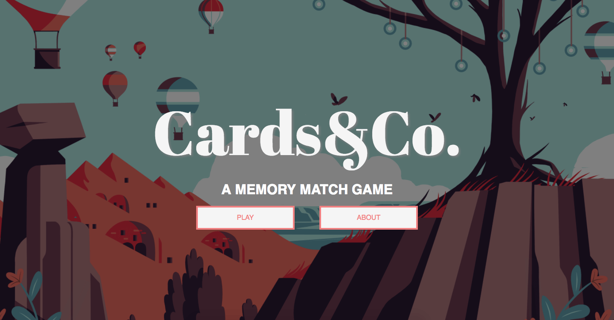
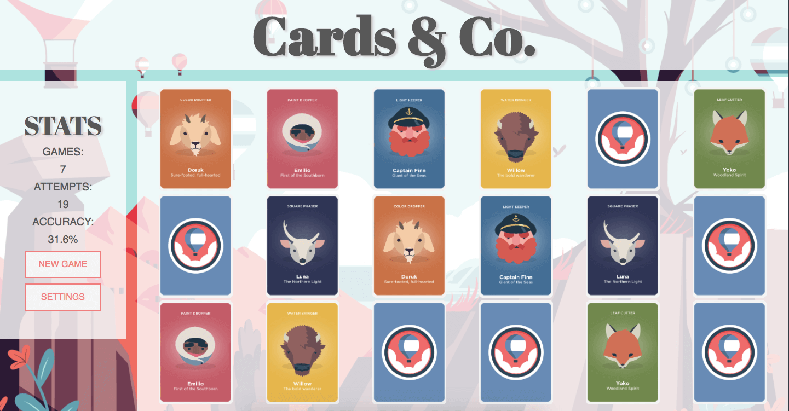
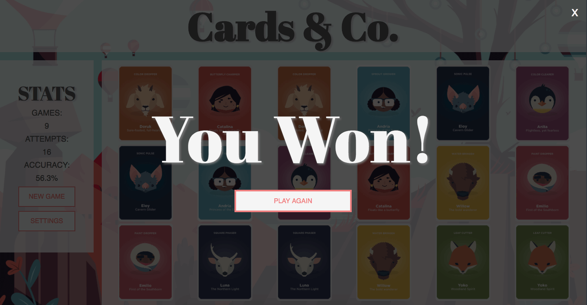

# Cards&Co

> Based off the mobile game "Dots&Co", Cards&Co is a memory match game built in ReactJS and Redux and styled with Flexbox and CSS Grid.

## Getting Started

> Select a card pack out of four possible choices and find all the match pairs of companions to win the game!

|  |  |
| :-------------------------------------------------: | :-----------------------------------------------------: |

|  |  |
| :---------------------------------------------------: | :----------------------------------------------: |

## Technologies Used

*   HTML5
*   CSS3
*   Flexbox
*   CSS Grid
*   ReactJS
*   Redux
*   JavaScript
*   ES6
*   Adobe Photoshop

## Tools Used

*   Git
*   GitHub
*   MeisterTask
*   Chrome Dev Tools
*   Mozilla Firefox Dev Tools

## Author

*   Kelcey Lorenzo [GitHub](https://github.com/m13kelore) | [Portfolio](https://kelceylorenzo.com/)

## About the Project
